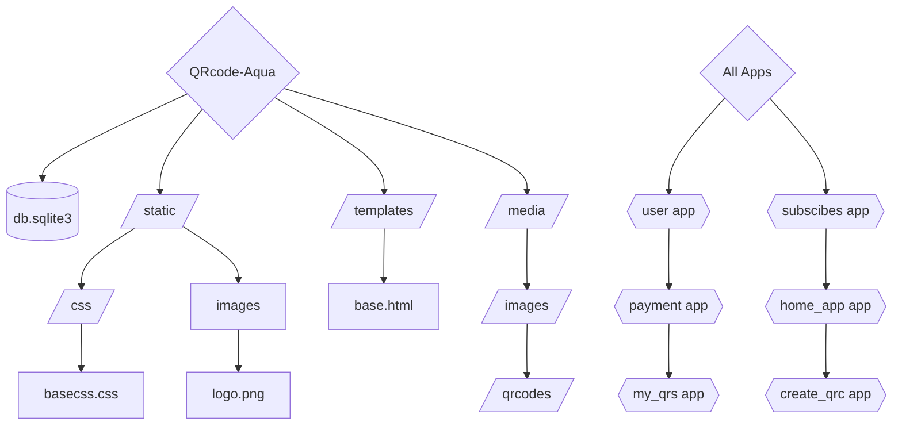
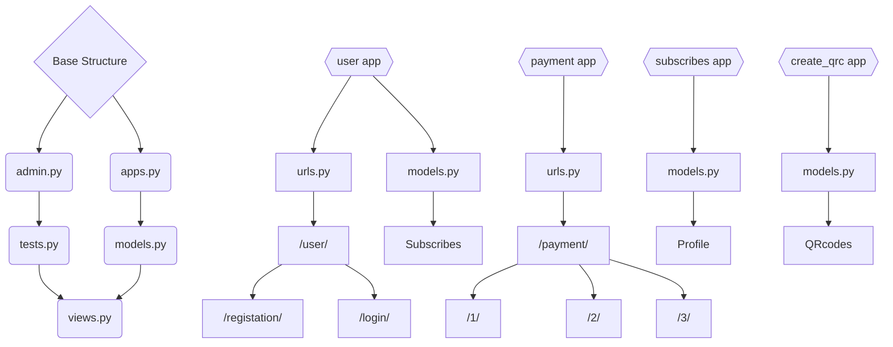

# Project "QRCode Aqua"
## Navigation / Навігація:
> [!TIP]
> - [Main information](#main-information-of-project--основна-інформація-про-проект)
> - [Technologies](#technologies--технології)
> - [Command structure](#command-structure--склад-команди)
> - [Figma & FigJam](#figma--figjam)
> - [Project structure](#project-structure--структура-проєкту)
> - [Applications and for what they needed](#applications-and-for-what-they-needed-they-main-functions--додатки-та-навіщо-вони-потрібні-їх-основні-функції)
> - [How run this project on your own PC](#how-correctly-run-the-project-on-your-own-pc--як-правильно-запустити-проект-на-вашому-власному-компютері)
> - [Project prospects / Перспективи проєкту](#project-prospects--перспективи-проєкту)
> - [Conclusion / Висновок](#Conclusion--Висновок)
# Main Information of project / Основна Інформація про проект:
## Technologies / технології:
> [!NOTE]
> - Django (Python module)
> - qrcode (Python module)
> - time (Python module)
> - os (Python module)
> - pillow (Python module)
> - sql
> - Figma
> - Figjam
> - git
> - Github
### QRCode Aqua project can do / QRCode Aqua project може робити:
- Generate and save customizated QR-codes / Генерує а також зберігає кастомізовані QR-коди 
- Can changing type of subcribes with payment methods / Може змінюваати типи підписок с оплачуваними методами
- Saves every qr-code who was created by user / Зберігає кожжний QR-код який був створений користувачем
- Control and limit the action of the QR-code / Контролює й обмежує дії с QR-кодом
____
### Why this project is useful / Чому цей проект корисний:
- Цей проєкт буде корисний якщо вам потрібно згенерувати просто та швидко кастомний QR-код за вашим URL-посиланням або інформацією.
- This project will be useful if you need to generate a custom QR code based on your URL link or information simply and quickly
## Command structure / склад команди:
- Illya Shramko / Ілля Шрамко (Team Lead) [github.com/IllyaShramko](https://github.com/IllyaShramko/QRcode-Aqua)
- Timur Koshel' / Тимур Кошель [github.com/kosheltimur](https://github.com/kosheltimur/QRcode)
- Egor Galkin / Єгор Галкін [github.com/EgorGalkinORG](https://github.com/EgorGalkinORG/QRcode-Aqua)
- David Petrenko / Давид Петренко [github.com/Davidptn](https://github.com/Davidptn/Qr_Aqua)
____
> [!NOTE]
> ## [Figma](https://www.figma.com/design/MmrkuvX06fTykUtPIY5vig/Untitled?node-id=0-1&t=zx68S8o0qcLjLxW1-1) & [FigJam](https://www.figma.com/board/IK5GgL0IesWTOP4s8QbsvZ/FigJam-QRAqua?node-id=0-1&t=K6yqz4vuzxA6GEBs-1)
____
# Project structure / Структура проєкту:

## Structure apps / Структура додатків:

### EN:
> In the basic structure of applications, Django provides a basic number of files that are needed for the application to work, but we can extend the flexibility by creating our own files/folders that Django can also use.

> Because in all applications, exactly `home_app`, `user`, `payment`, `create_qrc`, `my_qrs`, we created `templates` and `static` folders. Because of this, the applications work almost independent, so if you disable any of the applications, the project will continue to work.

> We also created a `urls.py` file in the `user` and `payment` applications to create sublinks for better navigation.

> In the `user`, `subscribes` and `create_qrc` applications in the standard `models.py` file, we created our own models such as: `Profile`, `Subscribe`, `QRcodes`. They improve the operation of applications, as they make it easier to manage, for example, the type of subscription a user has, or the number of QRcodes created
### UA:
> У базовій структурі додатків Django дає базову кількість файлів, які необхідні для праці додатка, але ми розширити можливості гибкості, створивши власні файли/теки, якими Django теж зможе користуватися.

> Тому у всіх додатках, а саме `home_app`, `user`, `payment`, `create_qrc`, `my_qrs`, ми створили теки `templates` та `static`. Через це додатки працюють майже автономно, тому якщо вимкнути якийсь із додатків, проєкт буде продовжувати працю.

> Також ми створили у додатках `user` та `payment` файл `urls.py`, щоб створити підпосилання для кращої навігації.

> У додатках `user`, `subscribes` і `create_qrc` у стандартному файлі `models.py` ми створили власні моделі такі як: `Profile`, `Subscribe`, `QRcodes`. Вони дуже покращують роботу додатків, так як з ними легше керувати наприклад типом підписки у користувача, або кількість створенних QR-кодів

____
## Applications and for what they needed, they main functions / Додатки та навіщо вони потрібні, їх основні функції:
> [!NOTE]
> ### EN:
> - Application `user` created for use functions __login__, __registration__ and __logout__. Also there created model __Profile__.
> - Application `subscribes` created for control and switch type of subscribe user, e.g. how much user can generate QRcodes, when the term of > work ends of QRcode. Also there created model __Subscribe__.
> - Application `payment` created for switch subscribe who was selected by user on page `subscribes`.
> - Application `my_qrs` created for keep user's QRcodes and delete they if it want user. Also `my_qrs` needed for redirect users on their > web-sites.
> - Application `home_app` it's main page for navigation on all other pages (`/create_qrc`,`/my_qrc`,`/subscribes`,`/logout`)
> - Application `create_qrc` created for generate customizated QRcodes by user url and save they on `my_qrc` page.
> ### UA:
> - Додаток `user` створений для використання функцій __login__, __registration__ і __logout__. Також тут створенна модель __Profile__.
> - Додаток `subscribes`, створений для керування та перемикання типу підписок користувача, наприклад скільки користувач може згенерувати > QR-кодів, коли закінчується термін роботи QR-коду. Також тут створенна модель __Subscribe__.
> - Додаток `payment`, створений для перемикання підписок, який вибрав обрав на сторінці `subscribes`.
> - Додаток `my_qrs`, створений для збереження QR-кодів користувача та видалення їх, якщо це потрібно користувачу. Також потрібен для > перенаправлення користувача на його сайт, який він вказав при створенні QR-кода.
> - Додаток `home_app` це головна сторінка для навігації на всі інші сторінках (`/create_qrc`,`/my_qrc`,`/subscribes`,`/logout`)
> - Додаток `create_qrc`, створений для створення кастомізованих QR-кодів за посиланням користувача та збереження їх на сторінці `my_qrc`.
____
# How correctly run the project on your own PC / Як правильно запустити проект на вашому власному комп'ютері:
> [!CAUTION]
> You must have install Python for work project, without he project will not start! [Install Python](https://www.python.org/downloads/release/python-3132/).

> [!WARNING] 
> Also you need install .git for clone project.
### For first, you need to clone this repository with command / Для початку вам потрібно скопіювати проект с командою:
```
git clone https://github.com/IllyaShramko/QRcode-Aqua.git
```
### Second, you need to create venv and install all requirements who typed bottom for correctly work project / По-друг, вам потрібно створити venv і встановити всі біблеотеки з файлу requirements, які перечислені внизу для коректної роботи проекту:
#### You can create and activate venv for 3 commands / Ви можете створити та активувати віртуальне оточення з допомоги 3 команд:
```
cd QRcode-aqua
```
On Windows console:
```
python -m venv venv
```
```
venv\Scripts\activate
```

On MacOS terminal:
```
python3 -m venv venv
```
```
source venv/bin/activate
```
### Third, libraries which you need to install for run the project / По-третє, модулі, які вам знадобиться установити для роботи проекту:
#### 1. django, it's main module for work all project, without he project won't be started! / django це головний модуль для роботи всього проекту, без нього проект не запуститься!
#### 2. os need for manupilate files, save qrcodes etc. / OS потрібен для маніпулювання файлами та збереження qr-кодів, тощо.
#### 3. qrcode, it's main module for generate qrcodes, without he project can started, but doesn't generate qrcodes / qrcode, це основний модуль для створення qr-кодів, без нього можна запустити проект, але не буде генерувати qr-коди
#### 4. pillow, it's needed for work module qrcode / pillow, потрібен для роботи модуля qrcode
#### 5. time, it's needed for control and limit the action on QR-codes / time, потрібен для контролю та обмеження дій над QR-кодами
### You can install all of this module for 1 command / Ви можете встановити усі ці модулі з допомоги 1 команди:
```
pip install -r requirements.txt
```
### Fourth, start project / По-четверте, запустити проєкт:
#### You need enter 2 commands in console/terminal / Вам потрібно ввести 2 команди у консоль/термінал:
```
cd blog
```
```
python manage.py runserver
```
____
## Project prospects / Перспективи проєкту:
### EN
- Convert all forms to DjangoForms
- Improve the payment system
- Add even more QR code customization

All this has not yet been implemented in the project, due to the fact that it does not work on host 24/7.
### UA
- Переробити всі форми на DjangoForms
- Доробити систему оплат
- Додати ще більше кастомізації QR-кодів

Це все поки що не було реалізовано у проєкті, через те що цей він не працює на хості 24/7.

# Conclusion / Висновок:
### UA:
#### Підвідимо підсумки:
Ми створили свій перший власний великий проєкт на фреймворці __Django__, при його створені ми пройшли через багато проблем, які вирішували по ходу його створення. 
Ми навчились:
1. Робити веб-проєкти на __Django__
2. Працювати з __django__, __qrcode__
3. Працювати з `media` файлами
4. Використовувати БД у своїх цілях

> По-перше зроблений великий веб-проєкт на __Django__, дуже покращив нам знання з Python та новим фреймворком __Django__, ми ознайомились з його функціями, можливостями, швидкістю та безпекою.

> По-друге ми ознайомились з новим модулем `qrcode`, коли ми створювали сторінку для генерації __QR-кодів__, ми ще не знали як можна створювати їх, але пошукали модуль на Python та знайшли! Ознайомившись з його повним функціоналом ми створили кастомну генерацію __QR-кодів__. Тепер ми знаємо як створювати __QR-коди__ на __python__

> По-третє ми також навчились працьювати з `media` файлами, а саме: підключати до проєкту, зберігати їх шлях у базі данних. Так як зберігати всі __QR-коди__ у теці `static` не дуже правильно, так як у `media` дуже зручно зберігати усі зображення, наприклад зображень __QR-кодів__ та аватарок профілей.

> По-четверте щоб було легше та швидше находити інформацію наприклад о __QR-коді__, ми використовували БД з власною моделю `QRcodes`, за допомогою цього, тепер щоб отримати певний __QR-код__ потрібно ввести 1 із його значень (наприклад по id). Також щоб контролювати тип підписки у користувача за допомогою моделі `Profile`, щоб ця модель корректно працьювала, ми використовували підключення `OneToOne` до стандартної моделі __django__, також щоб контролювати тип підписки ми використовували `ManyToOne`, не `OneToOne` та не `ManyToMany` так як в моделі `Subscribes` у нас тільки 3 типа підписок, тому `ManyToOne` забезпечує підключення `Багато до многих`, так як користувачів буде багато, а підписок тільки 3. Тепер ми навчились працювати з такими типами полями як: CharField, TextField, ImageField, ForeignKey, ManyToManyField, OneToOneField.

### EN:
#### Let's summarize:
We created our first own large project on the __Django__ framework, when creating it we went through many problems that we solved during its creation.
We learned:
1. To make web-projects on __Django__
2. To work with __django__, __qrcode__
3. To work with `media` files
4. To use the database for our own purposes

> First, a large web project was made on __Django__, which greatly improved our knowledge of Python and the new __Django__ framework, we got acquainted with its functions, capabilities, speed and security.

> Secondly, we got acquainted with the new `qrcode` module, when we created a page for generating __QR-codes__, we didn't know how to create them yet, but we searched for a module on Python and found it! Having familiarized ourselves with its full functionality, we created a custom generation of __QR-codes__. Now we know how to create __QR-codes__ in __python__

> Thirdly, we also learned how to work with `media` files, namely: connect to the project, save their path in the database. Since storing all __QR-codes__ in the `static` folder is not very correct, since it is very convenient to store all images in `media`, for example, images of __QR-codes__ and profile avatars.

> Fourthly, to make it easier and faster to find information, for example, about __QR-codes__, we used a database with our own `QRcodes` model, with the help of which, now to get a certain __QR-code__ you need to enter 1 of its values ​​(for example, by id). Also, to control the user's subscription type using the `Profile` model, so that this model works correctly, we used the `OneToOne` connection to the standard __django__ model, also to control the subscription type we used `ManyToOne`, not `OneToOne` and not `ManyToMany` since in the `Subscribes` model we have only 3 subscription types, therefore `ManyToOne` provides a `Many to Many` connection, since there will be many users, and only 3 subscriptions. Now we have learned to work with such types of fields as: CharField, TextField, ImageField, ForeignKey, ManyToManyField, OneToOneField.

### Many thanks to Egor Galkin, David Petrenko and Timur Koshel' for their work. But I especially want to say a big thank you to Egor for his great contribution to the project.